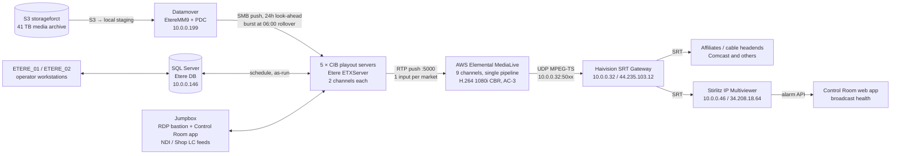

# Crossings TV / The Asian Channel — AWS Environment and Signal Flow

Handoff reference for the AWS signal-flow document. Compiled 2026-09-03 from a
live read-only inventory of the AWS account plus operator knowledge from the
July–September 2026 playout work.

How to read the confidence markers:

- **[LIVE]** — read from the AWS API on 2026-09-03.
- **[OPS]** — known from operating the system (Lee / Claude sessions). Correct as of the date given.
- **[CONFIRM]** — inferred. Check with Lee before you publish it.

Account: `122446024826`. Region: **us-west-2 (Oregon)** only. Everything sits in
one availability zone, `us-west-2a`, except the MediaLive subnet in `us-west-2b`.

---

## 1. Signal flow in one picture

Plain-language version:

1. Media files (commercials, programs) live in the S3 bucket `storageforct`.
2. The **Datamover** stages what the next broadcast day needs and pushes it over
   SMB to each **CIB** playout server's local `C:\ETXDBn\VIDEO` folder.
3. Each **CIB** runs Etere ETXServer. It plays the schedule stored in the
   **SQL Server** and streams each channel out as RTP.
4. Each channel lands on its own **MediaLive** input, is re-encoded to a fixed
   H.264 / AC-3 transport stream, and is sent by UDP to the **Haivision SRT Gateway**.
5. The **Haivision** box turns each UDP stream into SRT and delivers it to the
   affiliates. It also feeds the **Multiviewer**.
6. The **Multiviewer** watches every channel for video freeze and audio loss.
   Its alarm API feeds the Control Room "broadcast health" indicator.

---

## 2. Machines

### 2.1 EC2 instances [LIVE 2026-09-03]

| Name | Instance ID | Type | OS | Private IP | Public IP | Subnet | Duty |
|---|---|---|---|---|---|---|---|
| CIB_01 | i-0ff950a64257f46cb | m7i.2xlarge | Windows | 10.0.0.248 | — | Res-subnet | Playout: **NYC** (Etere channel 001) + **WDC** (008) |
| CIB_03 | i-0d991ada339ad8750 | m7i.2xlarge | Windows | 10.0.0.218 | — | Res-subnet | Playout: **SFO** (004) + **SEA** (005) |
| CIB_04 | i-047c0def44d5a1a09 | m7i.2xlarge | Windows | 10.0.0.203 | — | Res-subnet | Playout: **LAX** (006) + **CVC** (007) |
| CIB_05 | i-0e5fd27b8b08e8112 | m7i.2xlarge | Windows | 10.0.0.238 | — | Res-subnet | Playout: **MMT** (009) + **DAL** (010). Ex domain controller. |
| CIB_06 | i-0eb6756aa1edcea83 | m7i.2xlarge | Windows | 10.0.0.224 | — | Res-subnet | Playout: **CMP** (002) + **HOU** (003) |
| CIB_TEST | i-0ad305348ee0fdcd3 | m7i.2xlarge | Windows | 10.0.0.22 | 44.226.226.62 | mgmt-subnet | Spare / test playout box. **Stopped.** On-demand by design. |
| Datamover | i-00350e9c4ab66f867 | m7i.2xlarge | Windows | 10.0.0.199 | 35.83.140.112 | Res-subnet | Media mover (EtereMM9.exe), **PDC** domain controller, K:/M: file shares, air-check agent, Prometheus, CrashPlan, OneDrive |
| SQL Server | i-0c37cea16e35f6a2d | m7i.xlarge | Windows + SQL Std | 10.0.0.146 | — | DB-subnet | Etere database (`Etere_crossing`). Nightly 02:00 PT backup. |
| ETERE_01 | i-09dfd799d8a40d638 | t3a.xlarge | Windows | 10.0.0.59 | 54.69.251.173 | mgmt-subnet | Etere operator workstation. Also a **domain controller** (EC2AMAZ-99HQEN5); the CIBs sync time from it. |
| ETERE_02 | i-0e35dd4aee150d864 | t3a.xlarge | Windows | 10.0.0.57 | 44.232.19.238 | mgmt-subnet | Etere operator workstation |
| Jumpbox | i-0a9f88ee0ce8f1420 | m7i.2xlarge | Windows | 10.0.0.45 | 35.82.196.228 | mgmt-subnet | RDP bastion. Runs the Control Room web app (port 8000). Converts and streams the **CVC Tower NDI** feed 24/7. Receives the **Shop LC** live feed (UDP 5050). Etere ETXServer clients connect to it (ports 5959/5961). |
| Multiviewer | i-0596cebd55c39c653 | g4dn.xlarge (Tesla T4) | Windows 2019 | 10.0.0.46 | 34.208.18.64 | mgmt-subnet | Stirlitz IP Multiviewer Enterprise. Video wall + freeze/audio alarms. |
| Haivision SRT Gateway | i-0f639acd2912fe18e | c5.xlarge | Linux appliance | 10.0.0.32 | 44.235.103.12 | mgmt-subnet | Haivision Media Gateway 4.2. UDP in from MediaLive, SRT out to affiliates and Multiviewer. |

Notes:

- There is **no CIB_02**. Its leftover network interfaces were deleted 2026-08-31.
- Every Windows box carries the instance profile `EC2-SSM-Multiviewer`
  (SSM core, CloudWatch agent, CloudWatch read, S3 read). CIB_TEST has
  `CloudWatchAgentRole` only. Haivision has no profile. [LIVE]
- All playout boxes are identical as of 2026-08-28 [OPS]: m7i.2xlarge, one NIC,
  C: gp3 500 GB at 6000 IOPS / 500 MB/s, Etere 36.1.360.9454.
- Etere channel numbers follow the Etere market IDs (1 NYC, 2 CMP, 3 HOU, 4 SFO,
  5 SEA, 6 LAX, 7 CVC, 8 WDC, 9 MMT, 10 DAL). All five CIB pairings confirmed by
  Lee 2026-09-03.

### 2.2 Storage volumes [LIVE]

| Machine | Volume | Size | gp3 IOPS / MB/s | Purpose |
|---|---|---|---|---|
| Each CIB | C: | 500 GB | 6000 / 500 | OS + `C:\ETXDBn\VIDEO` playout media. Raised from default in Aug 2026 to stop 06:00 freezes. |
| Datamover | C: | 500 GB | 3000 / 125 | OS, S3 staging |
| Datamover | D: (xvdd) | 1500 GB | 3000 / 125 | **K:/M: company file shares**, air-check recordings |
| SQL Server | C: | 250 GB | 6000 / 125 | OS + database + local `.bak` files |
| Jumpbox | C: | 250 GB | 6000 / 500 | |
| ETERE_01/02, Multiviewer | C: | 200 GB | 3000 / 125 | |
| Haivision | root + data | 185 + 20 GB | 3000 / 125 | |

### 2.3 Machines outside AWS that touch the flow [OPS]

- **Control Room deploy host ("Bee")** — Linux Docker host on the Tailscale
  network. Runs a second copy of the Control Room app from `/opt/ctv-orderentry`.
  Deploys on every push to `main`.
- **Tailscale** — overlay network. Staff reach K:/M: shares, air checks, and the
  Datamover agent through Tailscale, not through open security-group rules.
- **Affiliate headends and tower operators** — Comcast (CVC, CMP, HOU, SFO, SEA,
  WDC, MMT), Charter (NYC, LAX), KQTA (SFO over-the-air), and Joe Winston's
  transmitter sites (KBTV Sacramento, KFWD/KLEG Dallas). Each one SRT-calls into
  its own Haivision listener port (table in 4.5).

---

## 3. Network [LIVE]

### 3.1 VPC and subnets

VPC `crossingstv-vpc` (`vpc-0d088c470fdd0e807`), CIDR **10.0.0.0/24**.
A second, unused default VPC (`172.31.0.0/16`) exists with no instances.

| Subnet | CIDR | AZ | Route table | Internet path | Members |
|---|---|---|---|---|---|
| mgmt-subnet | 10.0.0.0/26 | us-west-2a | Mgmt-Routetable (main) | **Internet gateway** — needs a public/Elastic IP to reach the internet | Jumpbox, ETERE_01/02, Multiviewer, Haivision, CIB_TEST, NAT gateway, MediaLive channel output ENIs |
| MediaLive Subnet | 10.0.0.64/26 | us-west-2b | Mgmt-Routetable | via IGW | MediaLive input endpoints (pipeline B, unused) |
| DB-subnet | 10.0.0.128/26 | us-west-2a | App-Routetable | **NAT gateway** 54.187.224.82 | SQL Server |
| Res-subnet | 10.0.0.192/26 | us-west-2a | App-Routetable | NAT gateway | 5 CIBs, Datamover, MediaLive input endpoints (pipeline A) |

- One NAT gateway `nat-004056bbf182a2c55` in mgmt-subnet, public IP 54.187.224.82.
  MediaLive input security group `1653768` whitelists exactly this IP.
- One S3 **gateway endpoint** (`vpce-05aae4fbb91462c79`) on both route tables.
  S3 traffic never leaves the VPC or crosses the NAT.
- No VPN connections, customer gateways, or Route 53 zones. Remote access is
  RDP to public IPs plus Tailscale.

### 3.2 Why the CIBs have one NIC now [OPS 2026-08-28]

Until August 2026 every CIB had a second "WAN" NIC in mgmt-subnet. That subnet
routes to the internet gateway, but the NIC had no public IP, so every flow
hashed onto it was black-holed. Symptoms: SSM agents "online but never execute",
credential errors, time-sync failures, off-air noise. The WAN NICs were built
for Comcast to SRT-call the CIBs directly. The Haivision gateway replaced that
path. All five WAN NICs were removed 2026-08-28 and deleted 2026-08-31.

Rule that came out of it: any instance in the 10.0.0.0/26 subnet must hold a
public or Elastic IP, or it cannot reach the internet.

### 3.3 Elastic IPs [LIVE]

| Public IP | Attached to |
|---|---|
| 35.82.196.228 | Jumpbox |
| 35.83.140.112 | Datamover |
| 54.69.251.173 | ETERE_01 |
| 44.232.19.238 | ETERE_02 |
| 34.208.18.64 | Multiviewer |
| 44.235.103.12 | Haivision |
| 44.226.226.62 | CIB_TEST (stopped) |
| 54.187.224.82 | NAT gateway |
| 100.22.1.236 | **idle** ("CIB04 WAN", release candidate) |
| 35.155.177.124 | **idle** ("SQL WAN", release candidate) |

### 3.4 Security groups [LIVE, after the 2026-09-01 audit]

| Group | Used by | Inbound summary |
|---|---|---|
| DVR-CIB-Datamover-SG | 5 CIBs, Datamover, CIB_TEST | ALL from 10.0.0.0/24; AD ports from 10.0.0.238 (legacy DC rules) |
| crossingstv-SG | Jumpbox, CIB_TEST | ALL from VPC; RDP 3389 from world; **UDP 5050 from 4 Shop LC IPs** (do not touch) |
| Etere-Workstation-SG | ETERE_01/02 | ALL from VPC; RDP from world |
| Database-SG | SQL Server | 1433, 80, 81, 443, 3389 from VPC only |
| Multiviewer | Multiviewer | 80, 443, 3389 from world |
| Haivision … AutogenByAWSMP | Haivision | 80, 443, 22 from world; SRT UDP 6000–6021 and 6200–6209 from world; UDP 5000–5029 from VPC and 100.20.174.0/24 |
| SRT Streams SG | CIB_06 (legacy) | SRT ports 5000–5009 / 6200–6209 from world — moot, CIB_06 has no public IP |
| Send to MediaLive | MediaLive channel output ENIs | ALL TCP/UDP from world (candidate to scope to VPC) |

Access policy (Lee, 2026-09-01): direct public-IP RDP only on Jumpbox, ETERE_01/02,
Multiviewer. Haivision web UI direct. Everything else through Tailscale.
Baseline of every rule before the audit: `tasks/sg-baseline-2026-09-01.json`.

---

## 4. Media chain, step by step

### 4.1 Media archive and staging [LIVE + OPS]

- **S3 `storageforct`** — 41.3 TB. Flat bucket of `.mp4` files named by the
  asset code (`4IMPRINT15E02.mp4`). This is the Etere media archive.
- **Datamover** (EtereMM9.exe) fetches from S3 and pushes to the CIBs over SMB
  (`\\10.0.0.2xx\etxdb`). The CIBs never pull from S3 themselves. Confirmed
  live 2026-08-27: 258 open files from the Datamover to CIB_01 mid-day.
- Each CIB runs an **Aligner** per channel (`etalign`). Every 10 minutes it asks
  for the files the schedule needs for "today, tomorrow". At the **06:00 local
  broadcast-day rollover** the window steps forward and about half a day's
  restores fire in one minute: ~20 GB lands on the CIB's C: drive at ~280 MB/s.
- That burst starved playout when C: was on default gp3 (125 MB/s) and caused
  the July–August "freeze then black at 06:00" incidents. Fix: gp3 6000 IOPS /
  500 MB/s on every CIB C: (2026-08-25/26). Verified clean 8/26–8/30.

### 4.2 Playout [OPS]

- **Etere ETXServer** on each CIB plays two channels (`user.00N` folders). It
  reads the schedule (`TPALINSE`) from SQL Server and writes as-run status back.
- Time: CIBs sync to ETERE_01 (10.0.0.59, domain `CTVEtere.local`). Datamover
  is the PDC (`EC2AMAZ-O6S9D82`) and points at Amazon Time Sync 169.254.169.123.
- Everything on a CIB is started by hand after a reboot (no Etere autostart).
- Logs: `C:\Users\usrcib<N>\AppData\Local\Etere\Log\user.0NN\`. ETXServer log
  retention is about 3–4 days.
- MMT plays MP4 06:00–24:00 and takes an **NDI feed 00:00–06:00**. DAL is 24/7 MP4. [OPS 8/25]

### 4.3 CIB → MediaLive [LIVE]

Each market has one MediaLive **input** of type `RTP_PUSH`, class STANDARD, named
"`<MKT> from Etere`". The CIB pushes RTP to the pipeline-A endpoint in Res-subnet
on port 5000.

| Market | Input ID | Pipeline A endpoint (Res-subnet) | Pipeline B endpoint (MediaLive subnet, unused) | Channel |
|---|---|---|---|---|
| NYC | 5260862 | rtp://10.0.0.253:5000 | 10.0.0.93 | 903885 |
| CMP (Chicago/Minneapolis) | 1350463 | rtp://10.0.0.241:5000 | 10.0.0.77 | 6495868 |
| HOU | 9726880 | rtp://10.0.0.210:5000 | 10.0.0.76 | 1538636 |
| SFO | 7230558 | rtp://10.0.0.240:5000 | 10.0.0.114 | 2505982 |
| SEA | 3584721 | rtp://10.0.0.230:5000 | 10.0.0.96 | 1857661 |
| LAX | 2642223 | rtp://10.0.0.201:5000 | 10.0.0.123 | 4459852 |
| CVC | 796095 | rtp://10.0.0.211:5000 | 10.0.0.94 | 2795113 |
| WDC | 3597338 | rtp://10.0.0.233:5000 | 10.0.0.119 | 8877392 |
| MMT | 9865589 | rtp://10.0.0.221:5000 | 10.0.0.124 | 4303233 |
| DAL | 7617948 | rtp://10.0.0.231:5000 | 10.0.0.70 | **none — input DETACHED** |

DAL has an input but no channel. Lee (2026-09-03): **CIB_05's Etere AU sends
the DAL output directly to the Haivision** as UDP on port 5015 ("Etere DAL Tower
In"). There is no MediaLive encode in between. It leaves the Haivision as SRT
:6015 to the Dallas OTA operator (KFWD 52.4 / KLEG 44.3). The DAL MediaLive
input is staged for the future: if the direct feed keeps showing packet issues,
DAL will be routed through a MediaLive channel like the other nine markets.

### 4.4 MediaLive channels [LIVE]

Nine channels, all `RUNNING`, all `SINGLE_PIPELINE`, all VPC-attached in
mgmt-subnet with security group "Send to MediaLive", role `MediaLiveAccessRole`,
logging disabled. Input spec: AVC, HD, max 20 Mbps. Input loss behavior:
CONTINUE (no slate configured).

Encode profile (same shape on every channel):

| Channel | Video | Audio | UDP output → Haivision |
|---|---|---|---|
| NYC | H.264 1920×1080, **6 Mbps CBR**, 29.97 fps, MAIN, GOP 15 | AC-3 2.0 **384 kbps** | udp://10.0.0.32:5014 |
| LAX | H.264 1920×1080, **6 Mbps CBR**, GOP 15 | AC-3 2.0 384 kbps ("NYC Audio" name reused) | udp://10.0.0.32:5009 |
| SEA | H.264 1920×1080, 8 Mbps CBR, GOP 90 | AC-3 2.0 192 kbps | udp://10.0.0.32:5003 |
| SFO | 8 Mbps CBR, GOP 90 | AC-3 192 kbps | udp://10.0.0.32:5005 |
| SFO Tower (2nd output on SFO channel) | **4 Mbps CBR**, GOP 90 | AC-3 192 kbps | udp://10.0.0.32:5016 |
| CVC ("CVC HD") | 8 Mbps CBR, GOP 90 | AC-3 192 kbps | udp://10.0.0.32:5006 |
| CMP ("CHI MSP") | 8 Mbps CBR, GOP 90 | AC-3 192 kbps | udp://10.0.0.32:5011 |
| HOU | 8 Mbps CBR, GOP 90 | AC-3 192 kbps | udp://10.0.0.32:5013 |
| WDC | 8 Mbps CBR, GOP 90 | AC-3 192 kbps | udp://10.0.0.32:5017 |
| MMT ("NAT") | 8 Mbps CBR, GOP 90 | AC-3 192 kbps | udp://10.0.0.32:5019 |

Container: MPEG-2 TS, 1000 ms buffer, no FEC. No MediaPackage, no MediaConnect
flows exist in the account.

### 4.5 Haivision SRT Gateway [LIVE 2026-09-03, read via REST API]

- Firmware 4.2.0-3694. Web UI and REST API at `https://44.235.103.12` (self-signed cert).
- Every **source** is a UDP unicast listener on `0.0.0.0:50xx`. MediaLive pushes
  the nine market streams to these ports. Two more sources (DAL 5015, CVC Tower
  5018) have **no MediaLive channel behind them**; they are fed directly from
  inside the VPC (see 4.7 and section 6).
- Every **destination** is an **SRT listener** on `0.0.0.0:6xxx`. The affiliates
  and the tower operators are SRT **callers**: they connect in to the Haivision.
  This is why the security group opens UDP 6000–6021 and 6200–6209 to the world.
  The Multiviewer is simply one more SRT client on the same listener ports.
- 14 routes. 12 running, 2 stopped test routes.

| Route | Source (UDP in) | Fed by | SRT listener out | Who connects | State |
|---|---|---|---|---|---|
| New York | Etere NYC In :5014 | MediaLive NYC | :6014 | Charter - NYC | ok |
| Chicago/Minneapolis | Etere CMP In :5011 | MediaLive CMP | :6204 | Comcast - CMP | ok |
| | | | :6010 | Play Pro CMP | disconnected |
| Houston | Etere HOU In :5013 | MediaLive HOU | :6205 | Comcast - HOU | ok |
| | | | :6012 | Play Pro HOU | disconnected |
| San Francisco Cable | Etere SFO in :5005 | MediaLive SFO | :6200 | Comcast - SFO | ok |
| | | | :6004 | Play Pro SFO | disconnected |
| San Francisco OTA | Etere SFO Tower In :5016 | MediaLive SFO (2nd output, 4 Mbps) | :6016 | KQTA - SFO Tower | ok |
| Seattle | Etere SEA In :5003 | MediaLive SEA | :6203 | Comcast - SEA | ok |
| | | | :6002 | Play Pro SEA | disconnected |
| Los Angeles | Etere LAX In :5009 | MediaLive LAX | :6008 | Charter - LAX | ok |
| Central Valley CA | Etere CVC In :5006 | MediaLive CVC | :6201 | Comcast - CVC | ok |
| | | | :6006 | Play Pro CVC | disconnected |
| Sacramento OTA | Etere CVC Tower In :5018 | **not MediaLive** (Jumpbox NDI converter, see 4.7) | :6018 | Joe Winston - Sacramento OTA (KBTV) | ok |
| Washington DC | Etere WDC In :5017 | MediaLive WDC | :6206 | Comcast - WDC | ok |
| | | | :6207 | Comcast - MMT (also attached here, see section 6) | ok |
| National Multimarket | Etere MMT In :5019 | MediaLive MMT | :6207 | Comcast - MMT | ok |
| | | | :6019 | Play Pro MMT | disconnected |
| Dallas | Etere DAL Tower In :5015 | **CIB_05 Etere AU directly** (no MediaLive) | :6015 | Joe Winston - Dallas OTA (KFWD and KLEG) | ok |
| Etere Test Feed 1 | Test CIB 1 In :5020 | — | :6020 | Etere - Test CIB 1 | stopped |
| Etere Test Feed 2 | Test CIB 2 In :5021 | — | :6021 | Etere - Test CIB 2 | stopped |

Naming pattern: Comcast/Charter destinations use ports 620x (cable headends),
tower/OTA destinations use 601x, and the "Play Pro" destinations use the even
600x/601x ports. All seven Play Pro destinations are disconnected; they are the
reason those routes show a "warn" status.

- The Haivision also delivered alternate content to NYC and WDC while CIB_01 was
  offline on 2026-08-28. It is the operator's manual failover tool.
- API reference: `.claude/documents/haivision-srt-gateway-api.md`. Login is in
  `credentials.env` (`HAIVISION_USER` / `HAIVISION_PASS`), never in the repo.

### 4.6 Monitoring: Stirlitz IP Multiviewer [OPS]

- `http://34.208.18.64` (plain HTTP, port 80). Every tile pulls SRT **from the
  Haivision** (10.0.0.32). Tile → source map read live from `/live/screens` on
  2026-09-03 [LIVE]:

| Multiviewer tile | SRT source on Haivision |
|---|---|
| New York | srt://10.0.0.32:6014 |
| Chicago Minneapolis | srt://10.0.0.32:6204 |
| Houston | srt://10.0.0.32:6205 |
| San Francisco | srt://10.0.0.32:6200 |
| SFO KQTA 15.3 (SFO over-the-air) | srt://10.0.0.32:6016 |
| Seattle | srt://10.0.0.32:6203 |
| Los Angeles | srt://10.0.0.32:6008 |
| Central Valley CA | srt://10.0.0.32:6201 |
| CVC KBTV 8.2 (CVC over-the-air) | srt://10.0.0.32:6018 |
| Washington DC | srt://10.0.0.32:6206 |
| National Multimarket | srt://10.0.0.32:6207 |
| Dallas KLEG 44.3 / KFWD 52.4 (The Asian Channel) | srt://10.0.0.32:6015 |

  Twelve tiles: the nine MediaLive markets, two over-the-air tower feeds (SFO,
  CVC), and Dallas. The Haivision therefore carries a **DAL** stream even though
  DAL has no MediaLive channel, so DAL reaches the Haivision by another path
  (section 4.3). The SFO Tower correlation is direct: MediaLive output
  `udp://10.0.0.32:5016` → Haivision SRT `:6016`.
- Alarm API: `GET /alarmsState/monitor?accessKey=…` (key-only). Four conditions
  per station: video freeze, video no-data, audio below threshold, audio no-data.
- Feeds the Control Room broadcast-health indicator (plan in `tasks/broadcast-health.md`).
- GPU driver upgraded to NVIDIA GRID 19.6 / 582.78 on 2026-08-26 after repeated
  BSOD 0x119 crashes.

### 4.7 Other feeds on the Jumpbox [OPS, CONFIRM details]

- **CVC Tower NDI** — the Jumpbox converts and streams this 24/7. The Haivision
  source "Etere CVC Tower In" (UDP 5018) has no MediaLive channel behind it, so
  the Jumpbox is the sender for the Sacramento OTA (KBTV 8.2) feed. [CONFIRM]
  It is a sustained real-time load: never move the Jumpbox to a burstable type,
  and a resize drops the tower stream.
- **Shop LC** — live feed received on UDP 5050 from four whitelisted IPs
  (67.79.26.10, 209.36.98.76, 209.36.98.66, 66.162.212.34). Etere schedules it
  as a live event (`LIVE_ID`), so the rows must never be "exploded". Rules on the
  Jumpbox security group for Shop LC are untouchable.

---

## 5. Supporting services

### 5.1 S3 buckets [LIVE]

| Bucket | Size | Purpose |
|---|---|---|
| storageforct | 41.3 TB | Etere media archive (see 4.1) |
| crossingstv-wordpress-backups | 8 GB | Website backups (Feb 2026 set) |
| crossingstv-databasebackups | 7.8 GB | `.dump` backups, twice-monthly 2024 series [CONFIRM still active] |
| crossingstvnetwork | 3.1 GB | [CONFIRM] |
| crossingshrportal | 0.4 GB | HR portal assets [CONFIRM] |
| theasianchannelwebsiteassets | ~0 | Asian Channel website images/schedules |

### 5.2 Backups [OPS]

- SQL Agent writes `Etere_crossing_backup_*.bak` daily at ~02:10 PT on the SQL
  Server. Its reads pin the C: throughput cap for ~20 minutes (known, accepted).
- A Monday 05:00 scheduled task (`C:\Scripts\onedrive_backup_sync.ps1`, rclone)
  copies the newest `.bak` to the `operations@crossingstv.com` OneDrive and
  keeps the four newest. Client secret expires ~June 2028.
- Datamover runs CrashPlan and OneDrive for the file shares.
- No AWS Backup plans, no DLM snapshot policies, no AMI schedule exist. [LIVE]

### 5.3 Alarms and notifications [LIVE]

- SNS topic `ctv-ebs-alerts` → Lee's email.
- 16 CloudWatch alarms: per CIB `ebs-throughput-90pct`, `ebs-queue-gt1`,
  `ebs-burst-balance-low` (plus a composite "saturated" that pages), and
  `SQL-ebs-queue-high` (threshold 3, raised 2026-09-02).
- Deliberately **no CPU or network alarms** (Lee's choice).

### 5.4 Management access [OPS]

- **AWS Systems Manager Run Command** is the working door into the Windows
  boxes (read-only PowerShell surveys, driver installs). All Windows boxes except
  CIB_TEST are SSM-registered. Haivision is not.
- AWS Health notice "SSM ec2messages end of support 2026-09-30" listed CIB_05 and
  CIB_06. Root cause was the dual-NIC black hole, fixed 8/28. Expect it to resolve ~9/4–9/6.
- After any **instance-type change** on a Windows box, the 169.254.169.x
  link-local routes can vanish (Jumpbox and Datamover both hit this 9/1). SSM,
  time sync and KMS all fail until the routes are rebuilt. Checklist in
  `tasks/cib-single-nic.md`.

### 5.5 Cost posture [LIVE + OPS]

- Reserved Instances (convertible) all expire **2026-10-10**: 6× m7i.2xlarge
  Windows, 1× m7i.xlarge Windows+SQL, 1× t3a.xlarge Windows.
- On-demand today: Jumpbox, ETERE_02, Haivision, Multiviewer.
- Decision (Lee, 9/1): let the RIs lapse, run on-demand for a clean Cost
  Explorer reading, then buy one 1-year partial-upfront Compute Savings Plan
  sized for the whole 24/7 fleet (~late Oct / early Nov).

---

## 6. Open items and known gaps (as of 2026-09-03)

- Confirm the sender of UDP port 5018 (CVC Tower) on the Haivision. No MediaLive
  channel feeds it; likely the Jumpbox NDI converter. [CONFIRM]
  (DAL on 5015 is confirmed: CIB_05 Etere AU direct.)
- Confirm what the seven "Play Pro" SRT destinations are for. All are
  disconnected today. [CONFIRM]
- The Washington DC route carries the "Comcast - MMT" destination (:6207) in
  addition to its own, plus one dangling destination ID that no longer exists.
  Two routes feeding one listener may be intentional; check. [CONFIRM]

- Release two idle Elastic IPs; delete the detached `vpn-nic` ENI (10.0.0.36);
  scope "Send to MediaLive" SG to the VPC; ask whether Haivision SSH/22 from the
  world is needed.
- No slate or input-loss image is configured on any MediaLive channel.
- Everything is single-AZ and single-pipeline. There is no automated failover;
  the Haivision re-route is manual.

---

## 7. Where the detail lives (repo paths)

| Topic | File |
|---|---|
| Single-NIC runbook, ENI history, resize checklist | `tasks/cib-single-nic.md` |
| Security-group baseline before the 9/1 audit | `tasks/sg-baseline-2026-09-01.json` |
| Haivision REST API | `.claude/documents/haivision-srt-gateway-api.md` |
| Stirlitz Multiviewer API | `.claude/documents/stirlitz-multiviewer-api.md` |
| Broadcast-health integration plan | `tasks/broadcast-health.md` |
| Etere data model and market/channel IDs | `.claude/documents/data-reference.md` |
| Deploy pipeline (push → Jumpbox / Bee) | `scripts/deploy/README.md`, `.github/workflows/deploy.yml` |
